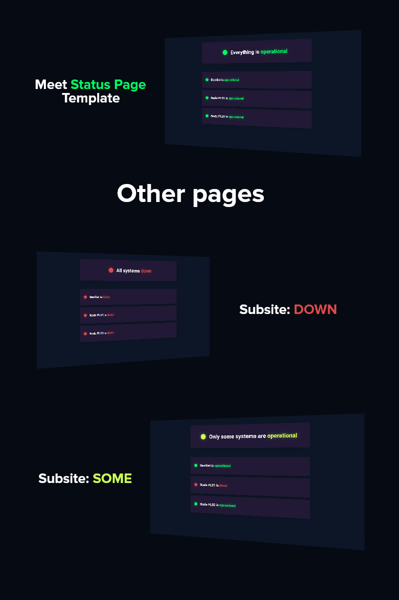

# Status Page Template

Inspired by [UptimeRobot](https://uptimerobot.com/statuspage)'s status site
 
Made by [ItsRemix](https://github.com/ItsRemix) and [mic0ishere](https://github.com//mic0ishere)

[Download](https://github.com/diffuse-network/status-page/archive/refs/heads/main.zip)

## Pages

- Up - [status-page/up](https://diffuse-network.github.io/status-page/pages/up.html)
- Down - [status-page/down](https://diffuse-network.github.io/status-page/pages/down.html)
- Some - [status-page/some](https://diffuse-network.github.io/status-page/pages/some.html)

## Showcase

  

